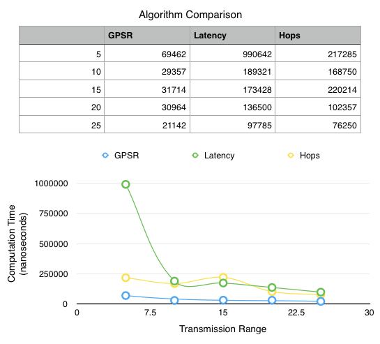
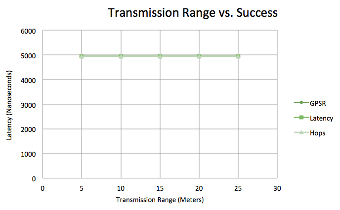

# Lab 2: GPSR and Dijkstra's Algorithms

## Proofs

### a) Prove GPSR, though greedy, is not an optimal solution for the wireless routing problem.

.

### b) Argue `dijkstraPathHops()` does better than GPSR at finding paths with minimum number of hops, but is still not an optimal solution to the routing problem.

.

## Efficiency Analysis

### a) Memory space efficiency & optimizations

The base program (VertexNetwork) creates and stores every vertex and edge with their associated costs.

My GPSR implementation uses that graph representation and stores the path of vertices as it goes. Thereby using only about 2*V + E spots in memory. Without the underlying implementation of the graph, its worst-case space is of O(V).

My Dijkstra implementation uses a slightly different graph representation. It stores the vertices in a min-heap and a vector. The min-heap allows fast removal of the minimum nodes while the vector allows for O(1) access to each node by their indices. Both data structures store the same set of pointers to my own `DijkstraNode` class. This class stores the current minimum cost and the predecessor that created that cost as well as the vertex index it references. This implementation has a worst-case space of O(V), not including the underlying graph representation.

Due to the differences made in the Dijkstra implementation, Dijkstra's algorithm was better able to remove the minimum-cost nodes very quickly while still allowing constant-time access to the nodes by their index values.

### b)

### c)

## Runtime Efficiency and Success Rate

